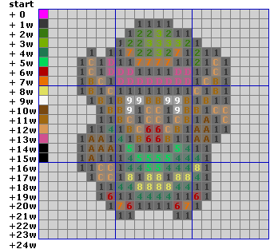
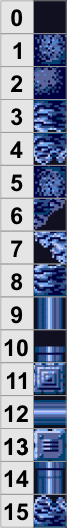
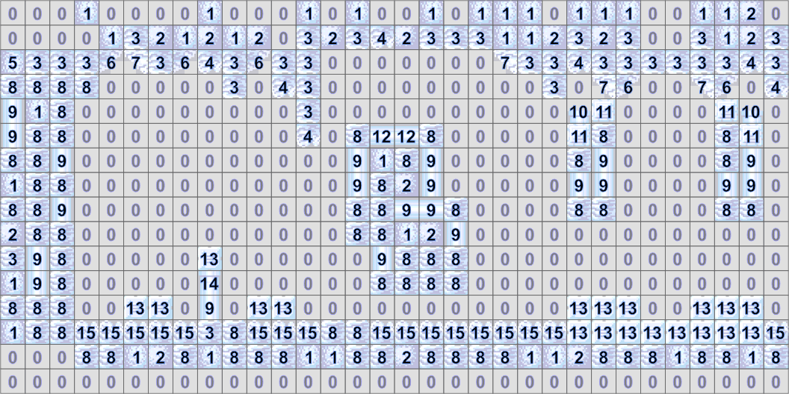
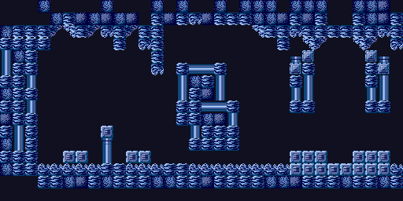
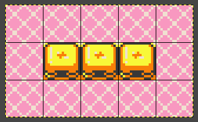
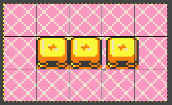
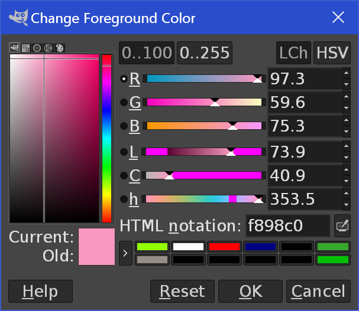

# VDP-16 (aKa PatrickBoy)
The VDP-16 is a fantasy arcade board to allow everyone to make web games which look like the 16-bit machines. It does so by providing a set of accurate tools and limitations from the time, like indexed color graphics, parallax layers and the mode 7.

Although it reproduces an old school environment, it is not strictly limited to it; it aims to bring you the "feeling" of what it is to develop for a 16-bit console. Limitations are designed to help you take the best out of the engine, have fun optimizing and understanding every aspect of it with rewarding results. It also aims to teach you how to code your games more efficiently. My reference for many technical choices was the Sega arcade board System 16.

The idea came as I was trying to develop a space shooter for the web. I wanted to used paletted graphics to alternate colors and make fun effects, and I also wanted parallax, screen tearing and mode 7 for some effects. As awesome as frameworks such as Pixi are, they just don't provide this functionality and it is hard to do it on your own. So I did it, and later found out that it was more fun if you had actually limitations. Having 8 layers and 256 colors per sprite like initially seems nice, but like most people I work much better within a budget. For me that meant maximize and having to make creative choices based on what I had. Therefore the limitations were born, and refined a lot over time, always in a goal to reduce the budget for games: if you use this or that functionality you lose something else, so don't over-engineer things, just choose what is appropriate for your game design, or let the limitations guide you on what you can achieve. Think having only one background layer and a few dozen sprites is limiting?  Look at this for example, it only uses one layer and much less sprites than the VDP-16 allows.

https://youtu.be/OHyvX5dzwEI


# Installing
Just extracting the samples should be enough. Inside there's a `packer.exe` application for Windows. If you use another OS, you should use [npm](https://www.npmjs.com/). Run `npm install` the very first time from the terminal, then `npm run pack-and-serve` will do the same as running the `packer.exe`.

Running the packer does two things: it converts and packs the graphics inside `gfx/` (see below for more information) and then starts a local web server, which simulates your game being online. After that you can just open your browser to the address specified (generally http://localhost:8080/) and the game should load.


# Distributing
Your game can be distributed by uploading the contents of the `build/` directory to any web server. Note that this is a development pre-version and is not licensed for use without my permission. It also will not work on older browsers (this would require additional steps which are going to be implemented shortly).


# Technical specifications in a nutshell
* Resolution: 256x256 pixels.
* Colors: 16 per sprite / map tile, from 4096 (RGB 12 bits).
* 1-2 backgrounds (tilemap) depending on the graphics mode.
* 256 sprites (divided into 16x16, around enough to fill the screen), can be stretched or shrunk.
* Translucency effects (shadows, lights, reflection, filter…) on 1 BG or a set of sprites.
* Fade in/out support (1 color, 16 factors).
* Transformation (rotation, scaling, scrolling) of background layers, specifiable per-line.
* Per-line color swap, allowing gradients and various effects.
* ROM: around 1 MB (2048x512 pixels, 4096 colors and 512x512 map blocks).
* Transfer to video memory: 120 kB/sec.
* Code: javascript (not limited, except to 256 kB for the final script).
* Audio: undecided yet, but probably FM with customizable input waveforms. If you have an idea of how it should be, please get in touch :)


# Basics
The VDP-16 uses external graphics data, packed as PNG files. They are in the number of 3: one for the sprites, one for the maps and one for the palettes. Drawable items are arranged in those images, and as such any item is identified by its type (sprite, palette, map), position (x, y) and size (w, h -- width, height).

Graphics data need to be built before launching/distributing the game, and are downloaded once at the startup of the game. After that, they are available in memory for read and write at any time. A copy of the ROM data is also kept for restoring data later in case you need it.

Other than that, it requires a javascript script file, which represents your code, which is loaded and ran at startup. You can refresh the page after you've made a change to your `.js` file (thereafter referred to as the code). You need to rebuild the graphics in case you've changed anything in the `gfx/` directory, including the `packer-main.js`.

The VDP-16 uses **tilemap graphics**, which means that graphics are subdivided in "tiles" (rectangles of pixels), which are then composed on the screen using a grid called the map. The map is a 2D array where each of its entries is a numeric value indicating the number of the tile to display.

Typically tiles are drawn together on one image, put next to each other (for example if you have 4 tiles of 16x16 pixels, the image is 64x16; but you may also organize them in several rows of a smaller size, like 2 rows of 32x16, in which case the first row represents the first two tiles, and the second row the last ones) and form a so called 'tileset'.

A map has a designated tileset (since it's only numerical values). You may swap the tileset to give another meaning to your map: for instance if your tileset contains images of rocks, you may swap it with blocks of grass to transform your rocky road into grasslands.

The same goes with tiles: each pixel is not represented as a color, but just a number, which refers to the index of the color in the palette. The same way, a tileset (or sprite, which are the same internally, a tileset just being a tiled sprite) has a designated palette and you may swap it. If you have shades of blue for a tile of water, you may replace it with a palette containing shades of red to make it lava.

On top of that, you may draw *objects*. Objects use the image of a sprite (or tiles from a tileset) and draw it directly on the screen, without needing a map. Objects are simpler, and you can put more of them on the screen. They can also be scaled up or down individually.

That's the basic idea. It takes a little bit of time to master, but it allows making a lot of creative things with little hand drawn graphics, and therefore is great for experimenting. It brings you access to many forgotten but fun techniques, and since it's the key to the efficiency of 16-bit consoles of the time, you can leverage this to make smaller and more impressive games which download in a second.

Mapping sprite pixels to colors:


Sample tileset:


Map entries (numbers):


Resulting tilemap:


[Reference for these images, and additional explanations](https://www.coranac.com/tonc/text/bitmaps.htm).


# The script API

When a script is loaded, it is expected to have a function named `main`. A global variable `vdp` is defined, which allows you to interact with the VDP-16. Here is a simple example of script modifying the color of the backdrop:

```
function *main() {
	vdp.configBackdropColor('#ff0');
	while (true) {
		yield;
	}
}
```

The `yield` instruction represents a breaking point: this will wait for the next frame. You need to have a loop with a yield instruction inside.


## The VDP
Exposes an interface to play with the graphics.

`configBackdropColor(c: number|string)`
The backdrop color is used as a background when covered by no background layer or object. Note that this color is actually the color (0, 0) in the palette (that is, the very first one). Colors on column 0 are supposed to be transparent, but this one is used for the backdrop. So calling this is shorthand for the following code:

```
const colors = vdp.readPaletteMemory(0, 0, 1, 1, vdp.CopySource.blank);
colors.array[0] = backdropColor;
vdp.writePaletteMemory(0, 0, 1, 1, colors);
```

Note: you can create a gradient affecting the backdrop by setting up a `LineColorArray` that targets the color 0 of palette no 0.

`configBackgroundTransparency(opts: {op: TransparencyConfigOperation, blendSrc: number|string, blendDst: number|string})`

Configure transparency parameters for the background layers. Note that only one background layer can be transparent, by setting the property `transparent: true` upon calling `drawBackgroundTilemap`. See the Transparency section below for more information.

`configColorSwap(colorTable: LineColorArray[])`


`configDisplay(opts: { extraSprites?: boolean } = {})`

The VDP-16 has two display modes. By default, it allows 2 background layers and 256 sprites, filling one layer worth of pixels (256 cells of 16x16). The second mode, by setting `extraSprites: true` allows for only 1 background layer but 512 sprites, or twice the number of cells. In this mode, you can draw 512 16x16 objects, 256 17x16 objects or 32x16 objects, 32 64x64 objects (since each of them takes up 16 16x16 cells), 2 256x256 objects, etc. or a mix of them.

`configFade(opts: { color?: number|string, factor: number })`

The VDP-16 includes a quick way to fade the screen toward a color. You typically use black or white, and specify a factor between 0 (nothing applied) and 255 (fully toward the destination color).

`configObjectTransparency(opts: {op: TransparencyConfigOperation, blendSrc: number|string, blendDst: number|string})`

Configure how objects with the attribute `transparent: true` are rendered. See the Transparency section below for more information.

`drawBackgroundTilemap(map: VdpMap|string, opts: {palette?: string|VdpPalette, scrollX?: number, scrollY?: number, winX?: number, winY?: number, winW?: number, winH?: number, lineTransform?: LineTransformationArray, wrap?: boolean, tileset?: string|VdpSprite, transparent?: boolean, prio?: number} = {})`

Draws a background tilemap layer.

* You can override the palette and tileset used (normally the one that the tilemap has been converted with) by specifying `palette: 'otherPalette'` or `palette: vdp.palette('otherPalette')`.
* You can scroll the layer using `scrollX` and `scrollY` (positive x goes to the left, negative x to the right, positive y goes downwards, negative y upwards). Scrolling affects only the layer in question, and notably not the objects. You may still need to keep track of a global "camera" and subtract its offset to the position of objects. Note that unlike objects, background layers do not have a position, they implicitely always fill the full screen.
* You can limit the area covered by the tilemap layer by providing `winX`, `winY`, `winW` and/or `winH`. The unused area can then be used as an inset to draw a window.
* You can specify a `LineTransformationArray` independently for each layer.
* Tilemap layers cover the full screen and as such wrap around in case the map is smaller than the screen, or has been scrolled past its boundaries. You can turn off this behaviour by setting `wrap: false`. Pixels outside of the bounds will be drawn with the last pixel in that direction (like `GL_CLAMP_TO_EDGE` for `glTexParam`).
* If `transparent: true` is specified, the tilemap has the transparent attribute set. It will be rendered using the color effect configured through `vdp.configBackgroundTransparency`. Note that only one layer may set this attribute.

`drawObject(sprite, x, y, opts: {palette?: string|VdpPalette, width?: number, height?: number, prio?: number, transparent?: boolean, flipH?: boolean, flipV?: boolean} = {})`

Draws an object (sometimes also referred to as a sprite, but a sprite is actually the graphics data used for an object, and multiple objects may be drawn out of the same sprite). Sprites are called this way because they are normally small.

`map(name: string): VdpMap`

Returns the address of a map. Can then be offsetted (see the DMA copies section for more information).

`palette(name: string): VdpPalette`

Returns the address of a palette. Can then be offsetted (see the DMA copies section for more information).

`readMap(map: string|VdpMap, source = CopySource.current): Array2D`

Reads the data for a map. The returned object is an `Array2D`, representing… a 2-dimensional array. You can get its `width`, `height` and a linear representation as a javascript array with `array`. You can then read and write safely to it by using `getElement(x: number, y: number): number` and `setElement(x: number, y: number, value: number)`.

`readPalette(palette: string|VdpPalette, source = CopySource.current): Array2D`

Reads the data for a single palette as an `Array2D` (see `vdp.readMap` for more info).

`readPaletteMemory(x: number, y: number, w: number, h: number, source = CopySource.current): Array2D`

Reads the data for a multiple palette as an `Array2D` (see `vdp.readMap` for more info).

`readSprite(sprite: string|VdpSprite, source = CopySource.current): Array2D`

Reads the data for a sprite or tileset as an `Array2D` (see `vdp.readMap` for more info).

`screenHeight: number` property

Contains the height of the screen.

`screenWidth: number` property

Contains the width of the screen.

`sprite(name: string): VdpSprite`

Returns the address of a sprite. Can then be offsetted (see the DMA copies section for more information).

`writeMap(map: string|VdpMap, data: Array2D`

Write an `Array2D` to a map. The `Array2D` must have been created by a call to `readMap` with the same argument for `map`, else they may not be compatible and crash.

`writePalette(palette: string|VdpPalette, data: Array2D)`

Write an `Array2D` to a palette. See `writeMap` for more information about these APIs.

`writePaletteMemory(x: number, y: number, w: number, h: number, data: Array2D)`

Write an `Array2D` to a section of the palette memory. See `writeMap` for more information about these APIs.

`writeSprite(sprite: string|VdpSprite, data: Array2D)`

Write an `Array2D` to a sprite/tileset, replacing its original data. See `writeMap` for more information about these APIs.

`input: Input` module (see Input section)

`color: color` module (see Colors section)

`mat3: mat3` module ([glMatrix](http://glmatrix.net/))

`vec2: vec2` module ([glMatrix](http://glmatrix.net/))

`LineColorArray` class (see the color swapping section)

`LineTransformationArray` class (see the per-line screen transformation section)

`CopySource` enum (see the DMA copies chapter)


## Transparency
Transparency in the VDP-16 is restricted in the following ways:

* Only one parameter can be defined for the backgrounds and objects. That is, all transparent objects will use the same color effect.
* There is no alpha channel, meaning that pixels are either opaque (color indexes 1 to 15) or transparent (color index 0). If an object/background is set as transparent, any opaque pixel will be blended with what's underneath using the transparency formula as defined by the user.
* Transparent objects cannot blend among themselves. That is, if an object is on top of a transparent background, the transparent background is ignored and the object pixel is blended with the opaque object/BG underneath directly.

These rules may take a bit of time to get used to, but they are extremely powerful. It just requires that you avoid using transparency where it's not needed. This should clean up your design a lot too.

The transparency is typically defined as follows:

`vdp.configObjectTransparency({ op: 'add', blendDst: '#888', blendSrc: '#000' });`

You have an operation, which can be `add` or `sub`. Color addition is typical and can be used for almost everything, and subtraction is more rare, mostly used for shadows and masking effects.

Then you have the `blendDst` and `blendSrc` colors. Here we define the destination (dst) as what's underneath the transparent object (i.e. the opaque geometry) and the source (src) as the color of the object/background currently being rendered on top.

The operation is then executed as follows, separately for each color component (red, green and blue), and the + being a - in case `op: 'sub'`:

`pixel.red = currentColorAtDestination.red * blendDst.red + objectColor.red * blendSrc.red;`

Suggested configurations are:

`{ op: 'add', blendDst: '#fff', blendSrc: '#fff' }`: adds the full source with the full destination (#fff is white, that is all components are 1), useful for lighting effects, clouds, etc. it was used a lot in RPGs. It also allows to fade in brightly-colored stuff by alterning the colors from black (all components 0, meaning "add 0", meaning that it's invisible) to the destination color.

`{ op: 'add', blendDst: '#888', blendSrc: '#888' }`: semi-transparency. You can use this by default, or for ghosts or paths to take. Note that adding #888 and #888 goes beyond #fff (the white color), and something more correct would be the #777 + #888 combination, but the code given above gives an equal coefficient for both objects, and saturated colors are clamped to #fff, so it's no problem.

`{ op: 'add', blendDst: '#888', blendSrc: '#000' }`: shadow. This ignores the source pixels by multiplying them by zero, meaning that whatever you draw will be black, and the color underneath is multiplied by 0.5. You may use this to draw something out of the same sprite that the one you're using for the gameplay, but as a shadow. Fantasy Zone (Sega System 16) uses that on the title screen for the drop shadow of the logo. Note that if you're using the semi-transparency as shown above, you may achieve the same effect by selecting an alternate palette for your transparent sprite, with all colors set to black.

```
const shadowPal = vdp.readPalette('ship');
shadowPal.array.fill(color.make('#000'));
vdp.writePalette('shadow', shadowPal);

vdp.drawObject('ship', x, y, {prio: 2});
vdp.drawObject('ship', x + 2, y + 2, {prio: 1, transparent: true, palette: 'shadow'});
```

`{ op: 'add', blendDst: '#000', blendSrc: '#fff' }`: no transparency. This is the identity operation, and renders transparent objects the same as opaque ones. May be useful to temporarily disable transparency without modifying the code.

`{ op: 'add', blendDst: '#080', blendSrc: '#fff' }`: slime translucency. Takes only the green channel from the destination and adds the color from the transparent object (which should lean towards green too for an efficient effect).

`{ op: 'add', blendDst: '#777', blendSrc: '#fff' }`: saturated semi-transparency. You can use dark colors to produce semi-transparency, and use clearer one to draw lights. A good all-rounder configuration.

`{ op: 'sub', blendDst: '#fff', blendSrc: '#fff' }`: color subtraction. Drawing a black object will do nothing (subtracts zero), while drawing a red object (red=1, green=0, blue=0) will remove all the red, creating a cyan mask over the background. You may use levels of gray to just darken the background uniformly.


## LineColorArray (color swapping)
Allows to define a color swap per line on the screen. Useful to create gradients and various color effects across the screen. This affects both objects and background layers.

`constructor(targetPaletteIndex: number, targetPaletteNumber: number)`

Builds an array targetting a given color index in a given palette. If you don't know, you can always look at the `palettes.png` file in the `build/` directory. The palette number is the row (y) and the palette index is the column (x). You can get the palette number by doing `vdp.palette('paletteName').y`.

`length: number` property

This property returns the size of the array, which should be equal to `vdp.screenHeight` (one array entry per line).

`setAll(paletteIndex: number, paletteNumber: number)`

Set the color replacement for the whole screen. Basically the color at (targetPaletteIndex, targetPaletteNumber) will be replaced by the color at (paletteIndex, paletteNumber) in `palettes.png`.

`setLine(lineNo: number, paletteIndex: number, paletteNumber: number)`

Sets the color replacement for a line only.


## LineTransformationArray (per-line screen transformation)
Allows to define a transformation per line on the screen for background layers only. Useful for raster effects (Sonic-like parallax scrolling, pseudo-3D mode 7, Hang On-like roads, …).

It uses a matrices to make geometric transformation from a straight image to a distorted image, combining the following three basic operations: translation, rotation and scaling. More info [here](https://www.mathplanet.com/education/geometry/transformations/transformation-using-matrices).

**Warning:** the per-line transformation works like the SNES and Game Boy Advance, meaning that the Y component is not inputted in the matrix transformation (this simplifies transformation calculations, since you'd have to subtract Y in an already pretty complex chain). Therefore, for simple transformations you need to add the line number by yourself on each line; if you set the identity matrix for every line, you'll just repeat the line 0 across the screen, getting weird vertical stripes, or nothing.

Also keep in mind that the transformation doesn't operate on the background layer itself, but on the pixel position. Therefore you have pixel position -> matrix operation -> destination position in the background. For instance, if you pass a matrix scaled by 0.5 you'll actually have a display zoomed 2x, since it scales the pixel positions by 0.5, advancing more slowly in the background layer texture than normal, resulting in a zoom.

This example divides the line number by two, resulting in a scale by two. The `vdp.mat3` and `vdp.vec2` modules use the same API as [glMatrix](http://glmatrix.net/).

```
function *main() {
	while (true) {
		const array = new vdp.LineTransformationArray();
		for (let line = 0; line < array.length; line++) {
			const mat = vdp.mat3.create();
			vdp.mat3.translate(mat, mat, [0, line / 2]);
			array.setLine(line, mat);
		}

		vdp.drawBackgroundTilemap('level1', { lineTransform: array });
		yield;
	}
}
```

Note: you may still combine the transformation array with scrolling, though it's not recommended.

`getLine(lineNo): mat3`

Gets the value of a line. Note that by default matrix values are initialized at 0, which is not equal to the identity (no operation). Use `mat3.create()` to create an identity matrix directly, or call `mat3.identity(matrix)` on the result of `getLine()`.

`length: number` property

This property returns the size of the array, which should be equal to `vdp.screenHeight` (one array entry per line).

`setAll(transformation: mat3)`

Helper that sets a transformation for the whole screen. Internally it will add the line number for you on each line by calling `mat3.translate(transformationForLine, transformation, [0, line])`.

`setLine(lineNo: number, transformation: mat3)`

Sets the transformation for a given line.


## Input
Input is exposed via `vdp.input`.

`hasToggledDown(key: Key): boolean`
Whether the key toggled down in the past frame. Example: `input.hasToggledDown(input.Key.A)` checks for A being just pressed. Use this in the menus or when triggering actions on key down, like a jump.

`hasToggledUp(key: Key): boolean`
Whether the key was just released.

`isDown(key: Key): boolean`
Whether the key is currently held down (also true when `hasToggledDown` is true).

`Key` enum
Contains the keys supported. By default, they are mapped as such on a keyboard, controllers not being supported yet:

```
	'ArrowUp': Key.Up,
	'ArrowDown': Key.Down,
	'ArrowLeft': Key.Left,
	'ArrowRight': Key.Right,
	'w': Key.Up,
	's': Key.Down,
	'a': Key.Left,
	'd': Key.Right,
	'j': Key.A,
	'k': Key.B,
	'h': Key.L,
	'l': Key.R,
	'c': Key.A,
	'v': Key.B,
	'x': Key.L,
	'b': Key.R,
	' ': Key.Select,
	'Enter': Key.Start,
```


## Colors
Methods which accept a color can take the following:

* A string, representing either a 32-bit color or a 12-bit color like in CSS. Example: `vdp.configBackdropColor('#ff0')` to set the backdrop color as yellow.
* A number, representing the color encoded as a 32-bit number in the form 0xAABBGGRR. Example: `vdp.configBackdropColor(0xff00ffff)` to set the backdrop color as yellow.
* Colors can be created using the `vdp.color` module. Example: `vdp.configBackdropColor(vdp.color.make(255, 255, 0))` for the same as above.

Note that the alpha channel is ignored by the VDP-16, but by convention we set it to 255 (opaque).

`color.make(r: number, g: number, b: number): number` or `color.make({r: number, g: number, b: number}): number`

This makes a color out of values for red (r), green (g) and blue (b), which can be between 0 and 256.

`color.makeFromFloat(r: number, g: number, b: number, a: number = 1): number`

Same as above, but with values going from 0 to 1 instead of 0 to 255.

`color.makeFromHsl(col: {h: number, s: number, l: number}): number`

Creates a color from its hue, saturation and luminance values (all between 0 and 1).

`color.toHsl(col: number): { h: number, s: number, l: number }`

Converts a normal color to HSL values.

`color.add(c: number, d: number): number`

Adds two colors (and saturates at 255).

`color.sub(c: number, d: number): number`

Subtracts two colors (and saturates at 0).

`color.mul(c: number, d: number): number`

Multiplies two colors component by component. For instance `color.mul(green, color.make(128, 128, 128))` makes dark green since 128 is roughly 0.5.

`color.blend(c: number, d: number, factor: number): number`

Blends two colors. A factor <= 0 takes `c` only, a factor >= 1 `d` only, and anything in between mixes them.


## DMA copies

With its 2D memory model, the VDP-16 is designed for moving data around easily, replacing graphics dynamically. For instance you may replace a sprite with another to animate all objects which use that sprite. This mimics the behaviour of DMA (Direct Memory Access) copies on older machines, whose role is just to copy data around in a very fast fashion.

The VDP-16 has limitations on the quantity of data that can be transferred: 2 kilobytes per frame. It's less than some consoles of the era; notably the Mega Drive with its "blast processing" could go up to around 11 kB/frame. However most consoles had pretty tough limitations on when data could be transferred, and doing a DMA would disable the CPU for the time of the transfer, which means that the higher transfer rates could only be achieved if there was no other processing happening and the display was turned off. Also, the VDP-16 has all data already available for drawing at any time thanks to the packer (comparable to the Neo Geo), whereas other machines required the game to first copy the data from the ROM to the VRAM.

Therefore the limitation is mainly set low to avoid overthinking your memory model: just use the packer and don't worry about it, the few bytes that you might squeeze are not worth the effort, especially since it will slow down the game. It's also secretly there to avoid you from relying too much on software rendering, since the processing power imposed heavy constraints on that back then.

DMA copies take this form:

```
const data = vdp.readPalette('mario', vdp.CopySource.rom);
vdp.writePalette('luigi', data);
```

There are three sources: `rom` (copy from the original graphics data as downloaded, can be used to restore overwritten graphics), `current` (copy from the current state of the memory), `blank` (ignore the current state of the memory, just return an `Array2D` with blank data of the same size as the item read from, which you can then write to and then copy to the destination).

The following two instructions are equivalent:

`vdp.drawObject('mario', 0, 0);`
`vdp.drawObject(vdp.sprite('mario'), 0, 0);`

The object returned by `vdp.sprite`, `vdp.palette` or `vdp.map` are "video memory address objects". These objects are defined as such:


```
class VdpMap {
	x: number; // U position in the map texture (cells)
	y: number; // V position in the map texture (cells)
	w: number; // width of sprite (pixels)
	h: number; // height of sprite (pixels)
	designTileset: string; // name of the tileset (VdpSprite)
	designPalette: string; // name of the first palette (takes precedence over the one defined in the tileset); tiles can use this and the next 15 palettes via the bits 12-15 in the tile number.

	// Adds x and y to the current address and sets w/h. Modifies and return this instance of VdpMap.
	offset(x: number, y: number, w: number, h: number): VdpMap;
}

class VdpPalette {
	y: number; // V position of palette (color units)
	w: number; // count (color units)
	h: number; // number of rows (consecutive palettes)

	// Adds y to the current address and sets w/h. Modifies and return this instance of VdpPalette.
	offset(y: number, w: number, h: number): VdpPalette;
}

class VdpSprite {
	x: number; // U position in the sprite texture (pixels)
	y: number; // V position in the sprite texture (pixels)
	w: number; // width of sprite or tileset as a whole (pixels)
	h: number; // height of sprite or tileset as a whole (pixels)
	tw: number; // tile width (pixels) if it's a tileset
	th: number; // tile height (pixels) if it's a tileset
	tiles: number; // number of (used) tiles in the tileset
	hiColor: boolean; // whether it's a 8-bit-per-pixel tile (or 4-bit)
	designPalette: string; // design palette name (can be overriden)

	// Adds x and y to the current address and sets w/h. Modifies and return this instance of VdpSprite.
	offset(x: number, y: number, w: number, h: number): VdpSprite;
	// Modifies this instance of VdpSprite (not the original) to target a given tile in a tileset.
	tile(no: number): VdpSprite;
}
```

You may modify these properties to read from/write to alternate parts in the memory.

# Using graphics and converting data
The VDP-16 comes bundled with a "packer" application. It can either be ran by `npm run pack-gfx` or by launching `packer.exe`.

The packer works with images (PNG) and Tiled (tmx) tilemap files. It also has a script called `packer-main.js` which must be inside the `gfx/` directory. This script tells the packer which graphics to include, in which palette. The graphics are then converted, indexed and written to the corresponding external graphics data files (`build/sprites.png`, `build/maps.png` and `build/palettes.png`).

```
config({ debug: true }, () => {

	palette('characters', () => {
		sprite('rock', 'gfx/rock.png');
		tileset('mario', 'gfx/mario.png', 16, 16);
	});

	palette('background', () => {
		tiledMap('background', 'gfx/background', { tileWidth: 16, tileHeight: 16, tilesetWidth: 32, tilesetHeight: 32 });
	});
});
```

This script defines two palettes ('characters' and 'background') and adds two sprites in the former: a rock (`gfx/rock.png`) and a "tileset", which is as mentioned earlier a tiled sprite. This means in this case that the `gfx/mario.png` file has more than one tile for our character. For instance it may do 64x16, which indicates that there are 4 16x16 tiles. We can then refer to these tiles individually when drawing the sprite 'mario' as an object on the screen, to create an animation.

The second palette, 'background', contains a tiled map (tmx file). Note the lack of extension: the file will be created by the packer, so you don't need to provide more than just an image that represents the contents of your background. The image will be divided in tiles (16x16 in this case) and put into a tileset of up to 32x32 tiles (1024; the hard limit in a single layer is 8192 tiles), written as `gfx/background-til.png`. Your image should have been thought to be subdivided in tiles. The packer will also create a `gfx/background.tmx`. This file can be opened in TMX to modify and extend your level. You may even add additional tiles to `gfx/background-til.png` following the same scheme. The next time you start the packer, it will not pick up the original `gfx/background.png` image because the `gfx/background.tmx` exists: it will pack it and the tileset instead (you may thus delete `gfx/background.png`).

Graphics are currently packed in the most basic way: it starts at the top-left corner and advances from left to right. When there's no more room to add an item, it switches to the next row, whose height is the maximal height of all elements which have been added to it. Because of that, if you add a sprite of 16x200 and then many sprites of 16x16, you'll waste all the space below the other sprites, since it can't be used (the next line will start at (x, y) = (0, 200)). In case you're short of memory, you may want to arrange your graphics with that in mind. Just change the order in which you add them.


## Drawing graphics with the VDP-16 in mind
The VDP-16 has some limitations in the format of the graphics, mainly aimed to to reduce the difficulty of drawing graphics and guide you to how it's fun to use. It also allows for putting much more data in less space, ideal for web games.

When drawing images that will be used as tilemap layers, preferrably **set up a grid in your drawing software.** As mentioned earlier, you should stick to 8x8 or 16x16 for your tiles, these are common and convenient formats given the screen resolution. On GIMP you can enable the grid by pressing slash and typing grid, then do View -> Show grid. It allows to quickly determine when objects are aligned or not.



In this example, we can get away with just two tiles: one for the background and one for the bench.



However in this example, the third bench is misaligned and as such will require 2 more tiles, raising the total to four. Drawing big images without taking that in account may get your tile count overboard. Remember that the main advantage of tiled graphics is to reduce memory a lot. If you don't use this advantage, the 1 MB cart limit will be hit very quickly, even with 4-bit graphics data. You may also hit the 8192 tiles limit: maps can not hold more than that since the entries are 16-bit numbers and the top 3 bits are used to offset the palette index, allowing to use up to 16 distinct palettes per background layer.

**Convert the first version of your background, then edit it with [Tiled](https://www.mapeditor.org/)**; once your map has been converted the first time by the packer, it will generate a `tmx` and a `-til.png` file with the same name as your original image. Use Tiled to extend your map using the existing tiles, or add tiles to the tileset in the same way. See the chapter about packing graphics for more information.

**Resist the urge to use many palettes.** It's not going to look much better than well made pixel art, and it's going to take you much more time to draw, increasing the chances that the result is bad more than anything. One palette per background layer, and 2-4 shared among all the common sprites for a given scene should be plenty. For the future, we're thinking about limiting to 8 palettes only; try to stick within that budget, at least per scene (i.e. not more than 8 palettes used at once).

**Alpha channel is not used** other than to determine which colors get assigned the index 0 (transparent). No semi-transparency information can be directly embedded in the source graphics: you can only make a set of objects or a layer semi-transparent as specified in the Transparency section. In general, you need to forget about semi-transparency in the first place, since it's reserved for special effects and takes time to master properly. Think of it as the cherry over the cake rather than an essential part of your graphics to constantly worry about.

**Colors are ultimately converted to 12-bit #rgb format**. Therefore gradients may not look so great. The 12-bit format was chosen because it's already used in CSS and can be easily represented when looking at the HTML notation of any color: just skip every other digit. In the example below `f898c0` will be translated as `#f9c`, then displayed as `#ff99cc` on a modern display.



